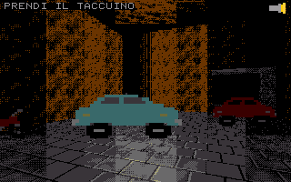

# Galleria 2007

Galleria 2007 is a retro first-person adventure game for
[PRG32](https://github.com/riscv-prg32/PRG32), set in Naples' historic
Galleria Borbonica during its rediscovery in 2007, three years before it
opened to the public.

> **Real history, invented mystery.** The Galleria's history in the in-game
> Archive is documented fact; the antagonist (*L'Uomo della Lampada*, the
> Lamp Man), his traces and the puzzle mechanics are game fiction, and the
> map is a provisional topological reconstruction — **not a survey**.



[30-second QEMU gameplay preview with the game's own audio](assets/store/preview-it.mp4)

## What it is

- A **Doom-like 2.5D portal renderer** (convex sectors, floor/ceiling heights,
  textured walls, floors and ceilings, depth-sorted billboards, torch-beam
  lighting and distance fog) in fixed-point C for native RV32IMC.
- A **playable vertical slice** of the 2007 discovery: access stairs, Bourbon
  tunnel, cistern overlook, vehicle deposit, air-raid shelter, the walled
  passage, the large cavity and the *pozzari* staircase to Vico del Grottone.
- **Two-button play:** D-pad moves and turns, **A** examines/takes/uses/records
  (hold to force), **B** toggles the torch, **A+B** opens the backpack (START
  also works).
- A **five-slot backpack** of real item instances: dropped objects stay in the
  shared world and anyone can recover them; puzzle items are never lost.
- **1–4 players** in one shared world through the PRG32 multiplayer service
  (cooperation and rivalry emerge; no PvP). Solo play is complete on its own.
- An **original adaptive soundtrack** (exploration, discovery, mystery,
  threat, chase, memory, silence) on PRG32's SID-like procedural instruments.
- A **historical Archive** unlocked by observation, with every entry labelled
  *documented history* or *game fiction*.
- **Language editions:** Italian (primary UI) and English, built as separate
  cartridges from the same code. They share one multiplayer signature, so
  Italian and English players meet in the same world. See
  [docs/localization.md](docs/localization.md).

## Status (v0.1.0 prototype)

| Area | Status |
|---|---|
| Build (IT/EN × ESP32-C6/QEMU) | done — `scripts/build.sh` |
| Host tests (unit + full solo walkthrough, both languages) | passing — `tests/run_tests.sh` |
| QEMU boot, input, render, audio | verified on PRG32 QEMU firmware |
| Same `.prg32` on PRG32-QT and PRG32-iOS | verified on both emulator cores (`scripts/check_hosts.sh`); position independence proven on every build |
| Store metadata, colophon, icon, screenshot, 30 s preview, bundles | done; both bundles accepted by the Store's own ingestion code — ready for submission |
| Frame rate | cartridge compute cut from ≈31 ms to ≈7 ms per moving frame (modelled); ≈23 fps estimated on the board, up from ≈13 — [docs/performance.md](docs/performance.md) |
| Physical ESP32-C6 performance, multiplayer on boards | **pending hardware** — see [docs/acceptance.md](docs/acceptance.md) |
| Galleria Borbonica validation of map/texts/branding | **pending partner** — see [docs/provisional.md](docs/provisional.md) |

The bundles in `dist/` are ready for submission; publishing is a human,
authenticated step described in [docs/store_publishing.md](docs/store_publishing.md).
The ESP32-C6 hardware checks in [docs/acceptance.md](docs/acceptance.md) are
still pending and should be completed before or right after submission.

## Budgets (measured, Italian edition)

| Limit | Used | Limit |
|---|---:|---:|
| Executable cartridge RAM (code + data + bss) | 57,756 B | 65,536 B (PRG32 default 64 KiB profile) |
| Stored package (code + audio + Store trailer) | 54,893 B | 65,536 B |
| QEMU load image (header + code/data + audio) | ~45,110 B | ~54,500 B (measured by Cockroaches_Cathisteria) |

## Build

Prerequisites: a [PRG32](https://github.com/riscv-prg32/PRG32) checkout next to
this repository (or `PRG32_REPO`), ESP-IDF 5.4+ with the RISC-V toolchain,
Python 3 with Pillow. For QEMU, Espressif `qemu-riscv32` and the PRG32 QEMU
firmware (`python3 -m prg32 qemu build` in the PRG32 checkout).

```bash
source ~/esp-idf/export.sh
tests/run_tests.sh shots          # host tests + screenshots in build/shots/
scripts/build.sh                  # dist/galleria2007-{it,en}-{esp32c6,qemu}.prg32
scripts/pack-store-bundle.sh      # dist/galleria2007-{it,en}-0.1.0-store.zip (Store-validated)
scripts/check_hosts.sh            # run them on PRG32-QT, PRG32-iOS and QEMU
scripts/perf.sh                   # per-frame cost table (PRG32-QT ESP32-C6 model)
```

Build only one edition or target with `LANGS="en" scripts/build.sh qemu`.

## Run

QEMU (from the PRG32 checkout):

```bash
python3 -m prg32 qemu upload ../Galleria2007/dist/galleria2007-it-qemu.prg32
python3 -m prg32 qemu run
```

Keys in the QEMU terminal: arrows or WASD move/turn, `J`/`Z` = A, `K`/`X` = B,
press `J` then `K` quickly for A+B, Enter = START.

ESP32-C6 board:

```bash
python3 -m prg32 esp32c6 upload ../Galleria2007/dist/galleria2007-it-esp32c6.prg32 --url http://192.168.4.1
```

Scripted QEMU screenshots, audio and the 30-second preview:

```bash
scripts/qemu_preview.py --script smoke --out build/qemu-smoke
scripts/qemu_preview.py --script preview --video --out build/qemu-preview
```

## Documentation

Start at [docs/index.md](docs/index.md).

| Document | Contents |
|---|---|
| [docs/reproduce.md](docs/reproduce.md) | rebuild the released artefacts exactly, with versions and expected outputs |
| [docs/replicate.md](docs/replicate.md) | build your own cartridge on this engine |
| [docs/portability.md](docs/portability.md) | one unchanged `.prg32` on the firmware, QEMU, PRG32-QT and PRG32-iOS |
| [docs/store_publishing.md](docs/store_publishing.md) | bundle format, validation, submission |
| [docs/architecture.md](docs/architecture.md) | modules, game loop, state machines, memory budget |
| [docs/renderer.md](docs/renderer.md) | portal raycaster maths, fixed-point formats, lighting, palette |
| [docs/gameplay.md](docs/gameplay.md) | controls, backpack, puzzle, LampMan, narrative beats |
| [docs/multiplayer.md](docs/multiplayer.md) | gossip protocol, conflict rules, packet layout |
| [docs/audio.md](docs/audio.md) | adaptive music states, instruments, effects |
| [docs/localization.md](docs/localization.md) | language editions, string pipeline, adding a language |
| [docs/history.md](docs/history.md) | historical anchor, provenance labels, guardrails |
| [docs/testing.md](docs/testing.md) | host tests, QEMU runs, media validation |
| [docs/performance.md](docs/performance.md) | cost model and tuning knobs |
| [docs/acceptance.md](docs/acceptance.md) | acceptance checklist and hardware/multiplayer report templates |
| [docs/provisional.md](docs/provisional.md) | provisional assets/geometry awaiting Galleria validation |
| [assets/source/SOURCES.md](assets/source/SOURCES.md) | asset and rights manifest |

## License and attribution

Code and original assets: MIT (see `LICENSE`). The Galleria Borbonica's name
and history are cited descriptively for cultural outreach; this project has
no institutional partnership with the site's managers unless and until one is
announced with approved wording. No photographs of the site are shipped.
